<!DOCTYPE html>

<html lang="es">

<head>

<meta charset="UTF-8">

<meta name="viewport" content="width=device-width, initial-scale=1.0">

<title>Bazar Siglo - Colunga</title>

</head>

<body>

<header>

    <h1>🌟 BAZAR SIGLO 🌟</h1>

    
Calidad y cercanía en el corazón de Colunga

    <a href="#catalogo-productos">Productos</a>

</header>

<main class="container">

<section class="horario">

    <h2>Horario</h2>

    
<strong>Lunes a Sábado:</strong> 9:00 - 21:00

    
<strong>Domingo:</strong> Cerrado

</section>

<section class="sobre-nosotros">

    
<h2>Sobre Nosotros</h2>

    

        Bienvenidos a <strong>Bazar Siglo</strong>, un negocio familiar con raíces en Colunga. Nos dedicamos a ofrecer productos útiles y de calidad para el hogar, playa y ocio, siempre con un trato cercano que hace sentir a cada cliente como parte de nuestra familia.

    

    

        Desde juguetes infantiles hasta artículos de viaje y limpieza de piscinas, cada producto es cuidadosamente seleccionado para brindar satisfacción y seguridad. Valoramos la confianza de nuestros clientes y trabajamos cada día para mantenerla.

    

</section>

<!-- GALERÍA DE LA TIENDA -->

<section id="galeria-tienda">

    
<h2>Nuestra Tienda</h2>

    

        
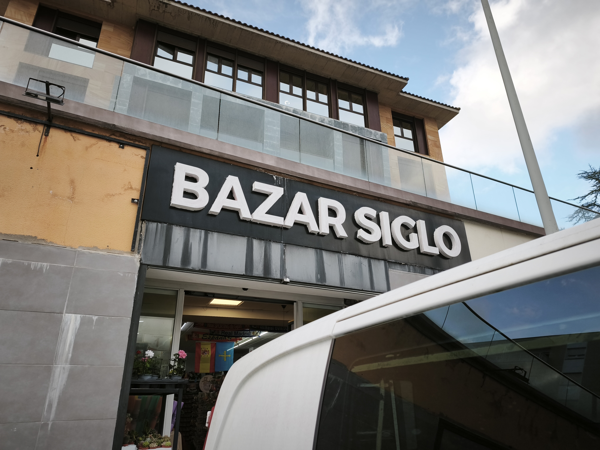

        
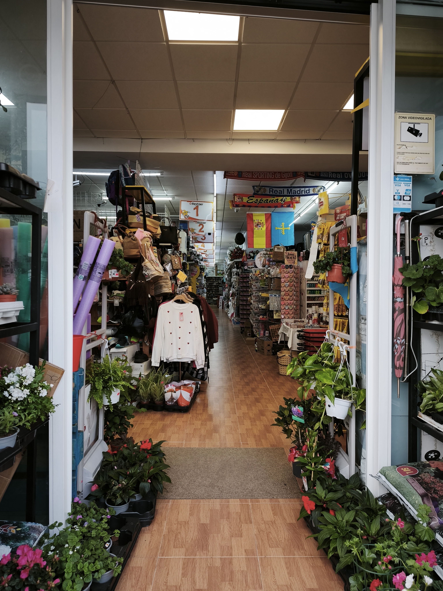

        
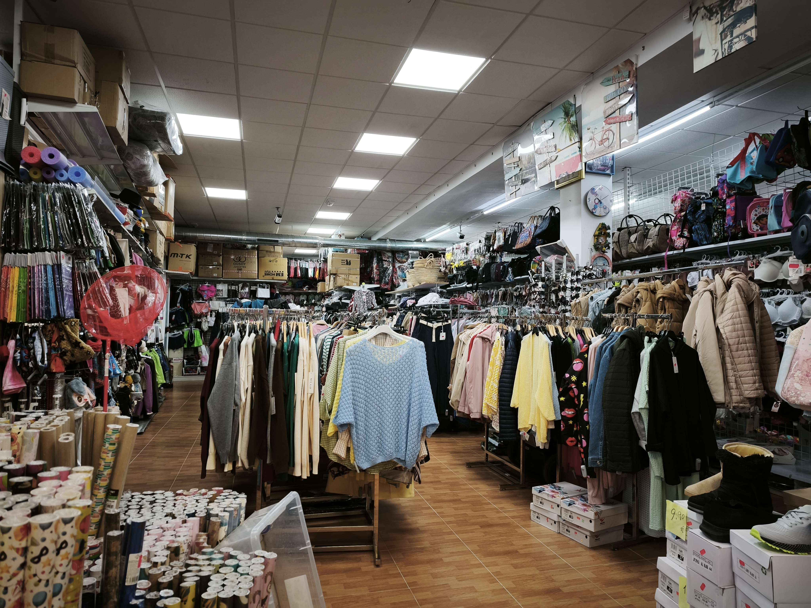

    

</section>

<section class="mapa">

    
<h2>Ubicación</h2>

    

        <iframe src="https://www.google.com/maps?q=Calle+Loreto,+Colunga,+Asturias&output=embed" width="100%" height="350" style="border:0;" allowfullscreen="" loading="lazy"></iframe>

    

</section>

<!-- CATÁLOGO DE PRODUCTOS -->

<section id="catalogo-productos">

    
<h2>Catálogo de Productos</h2>

    <section class="grid-productos">

        <article class="producto-card">

            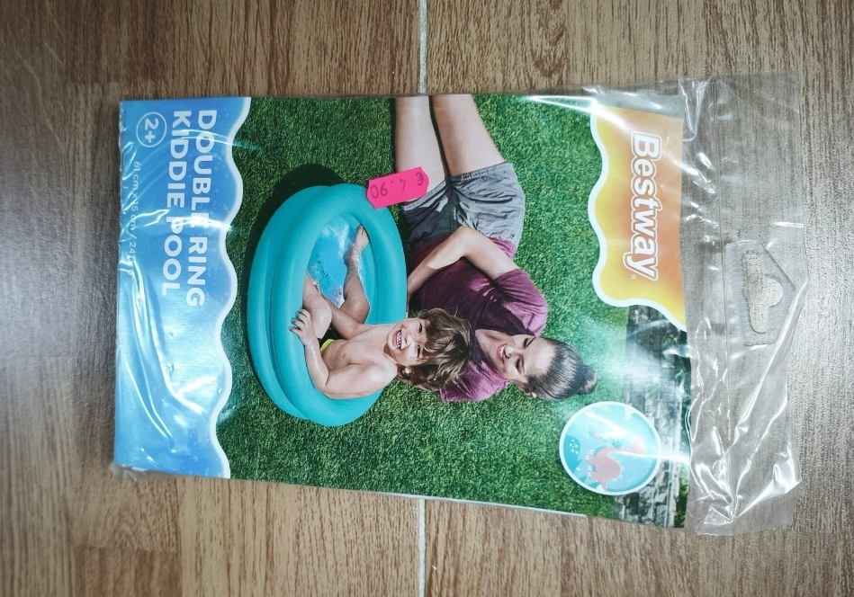

            

                <h3>Piscina Infantil Double Ring</h3>

                
Una piscina inflable ideal para niños, resistente y segura. Perfecta para refrescarse en verano y disfrutar del agua en el jardín o la terraza. Incluye válvula de inflado rápido y paredes duraderas.

                4.90€

            

        </article>

        <article class="producto-card">

            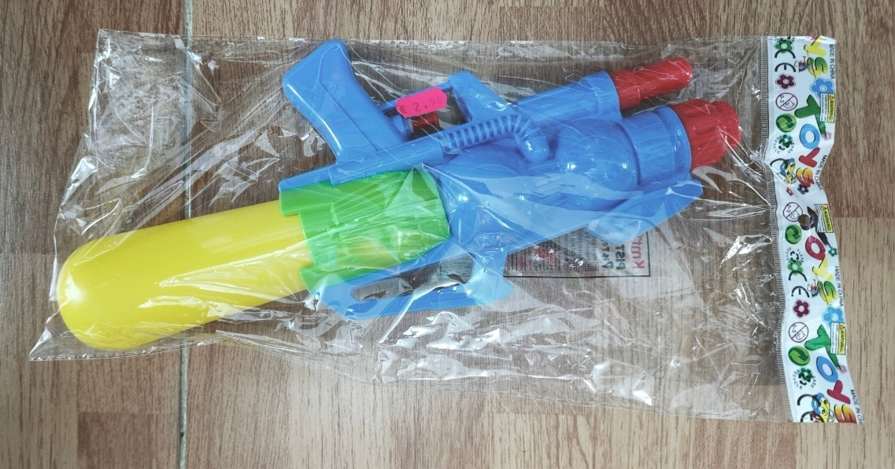

            

                <h3>Pistola de Agua Super Soaker</h3>

                
Diversión sin fin en la playa o el jardín. Pistola de agua con gran capacidad de carga y fácil de usar, perfecta para juegos de verano y batallas acuáticas con amigos y familiares.

                2.90€

            

        </article>

        <article class="producto-card">

            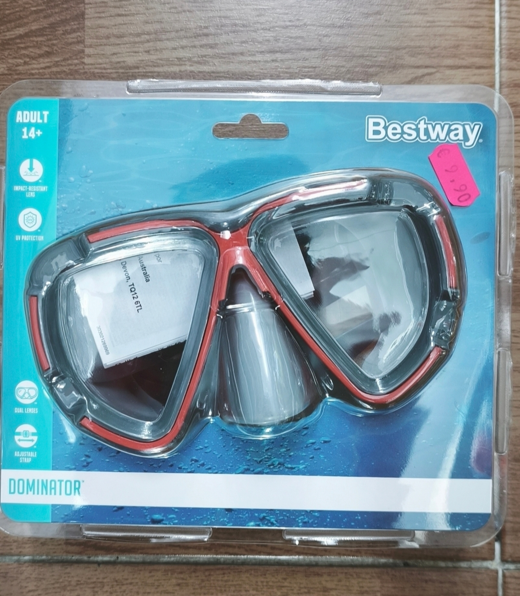

            

                <h3>Gafas de Buceo Dominator</h3>

                
Lentes de alta resistencia con protección UV. Perfectas para explorar el mar o la piscina con comodidad y seguridad, evitando la entrada de agua y ofreciendo visión clara bajo el agua.

                9.90€

            

        </article>

        <article class="producto-card">

            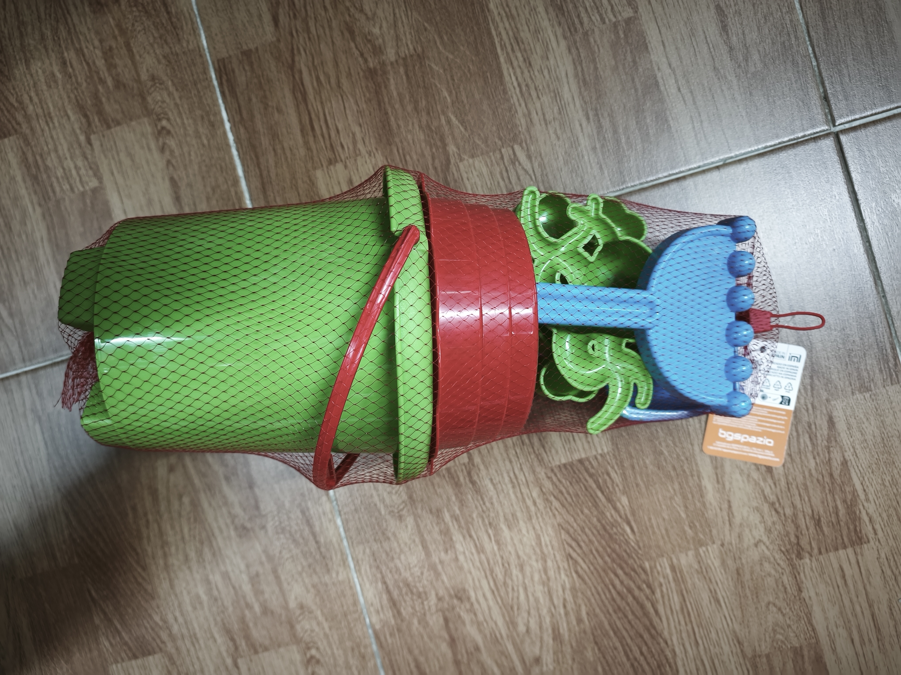

            

                <h3>Set de Playa para Niños</h3>

                
Incluye cubo, pala y rastrillo. Todo lo necesario para que los más pequeños construyan castillos de arena y disfruten de horas de juego en la playa de forma segura.

                6.90€

            

        </article>

        <article class="producto-card">

            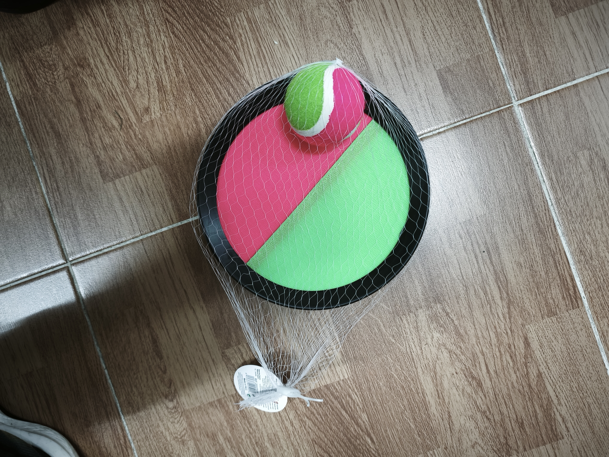

            

                <h3>Raquetas con Velcro</h3>

                
Juego de raquetas con pelota de velcro, ideal para jugar en la playa o en el jardín. Ligero y resistente, perfecto para que toda la familia disfrute de actividades al aire libre.

                4.50€

            

        </article>

        <article class="producto-card">

            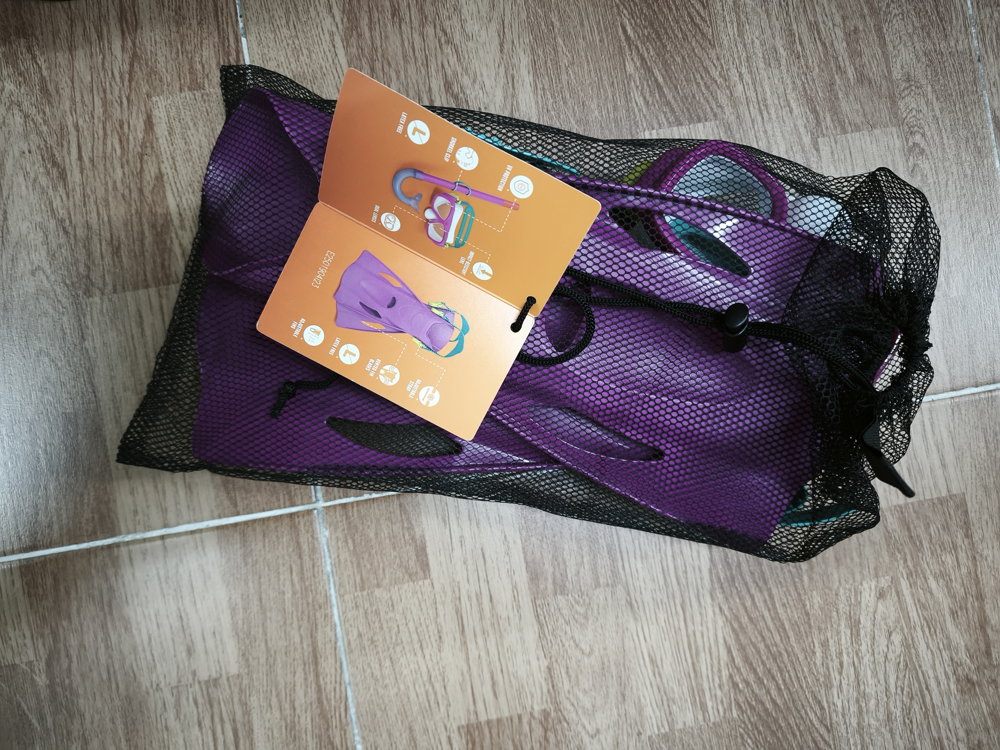

            

                <h3>Set de Buceo</h3>

                
Con gafas, tubo y aletas ajustables. Ideal para explorar la piscina o la playa con comodidad y seguridad, fomentando el juego y la aventura bajo el agua.

                13.90€

            

        </article>

        <article class="producto-card">

            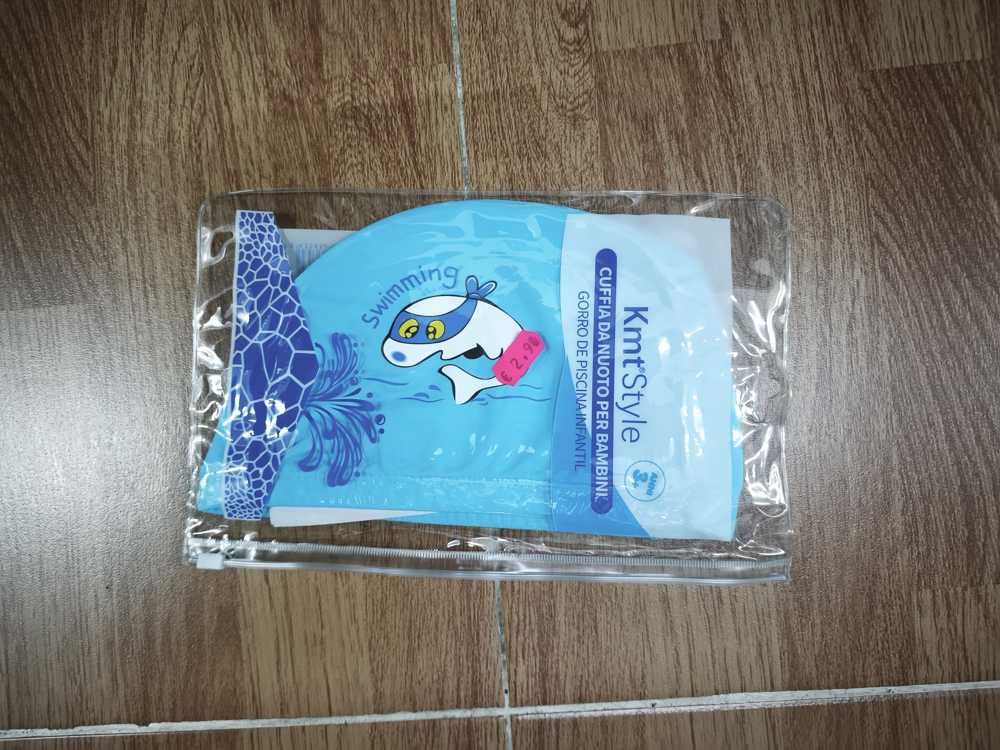

            

                <h3>Gorro de Piscina Infantil</h3>

                
Gorro cómodo y resistente para proteger el cabello de los niños mientras nadan. Disponible en colores divertidos, perfecto para clases de natación o juegos en la piscina.

                2.90€

            

        </article>

        <article class="producto-card">

            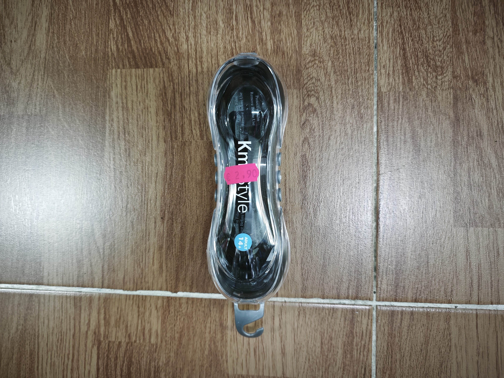

            

                <h3>Gafas de Natación</h3>

                
Gafas ajustables con silicona suave que evitan la entrada de agua. Perfectas para nadar en piscina o playa con comodidad y visión clara bajo el agua.

                2.90€

            

        </article>

        <article class="producto-card">

            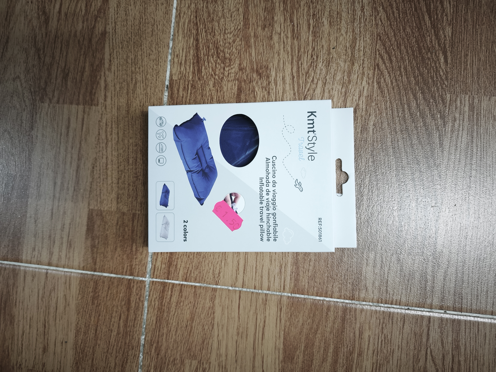

            

                <h3>Almohada de Viaje Hinchable</h3>

                
Ligera y cómoda, perfecta para viajes en coche o avión. Se infla fácilmente y proporciona soporte al cuello, asegurando descanso y confort durante desplazamientos.

                1.50€

            

        </article>

        <article class="producto-card">

            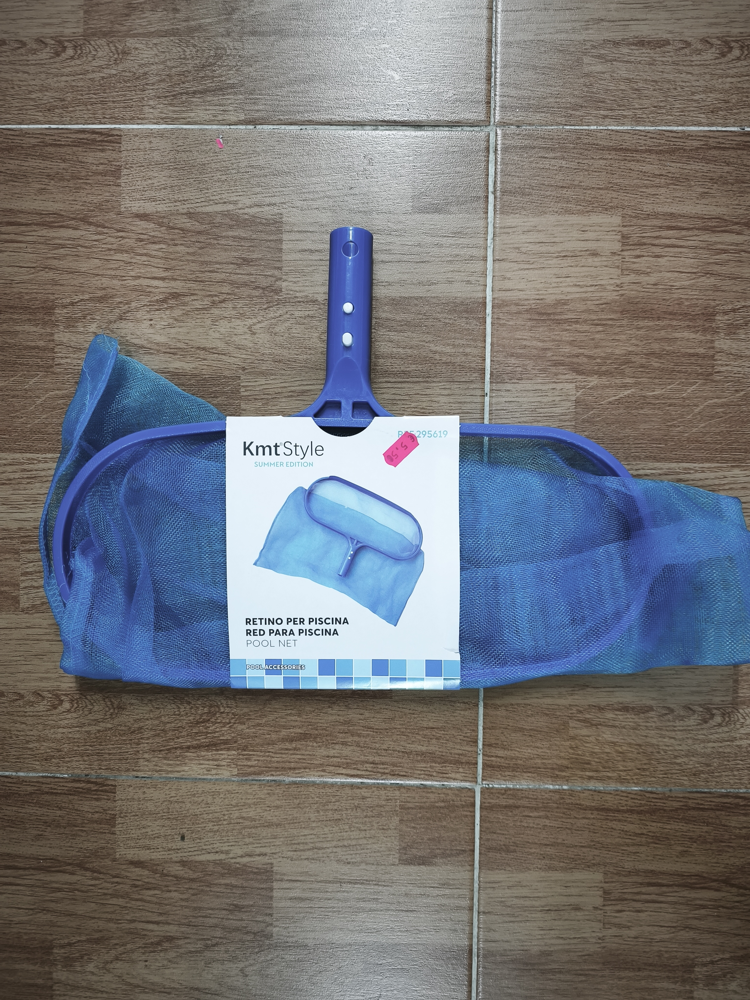

            

                <h3>Red para Limpiar Piscina</h3>

                
Red resistente para limpiar hojas y suciedad de la piscina. Fácil de usar, ligera y duradera, ideal para mantener el agua limpia y lista para el baño.

                5.50€

            

        </article>

    </section>

</section>

<footer>

<strong>Bazar Siglo - Colunga</strong>

<address class="direccion">Calle Loreto, Colunga, Asturias</address>

© 2026 Todos los derechos reservados.

</footer>

</body>

</html>